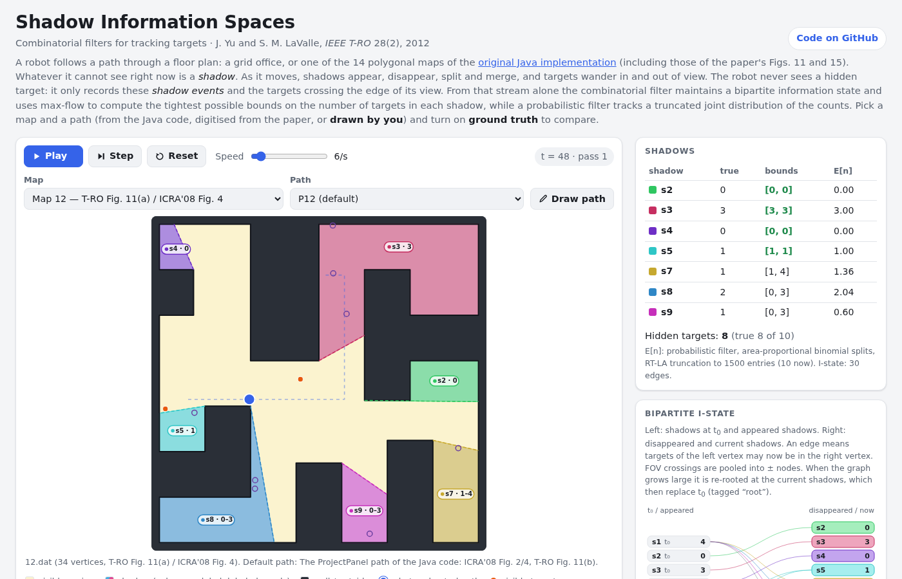
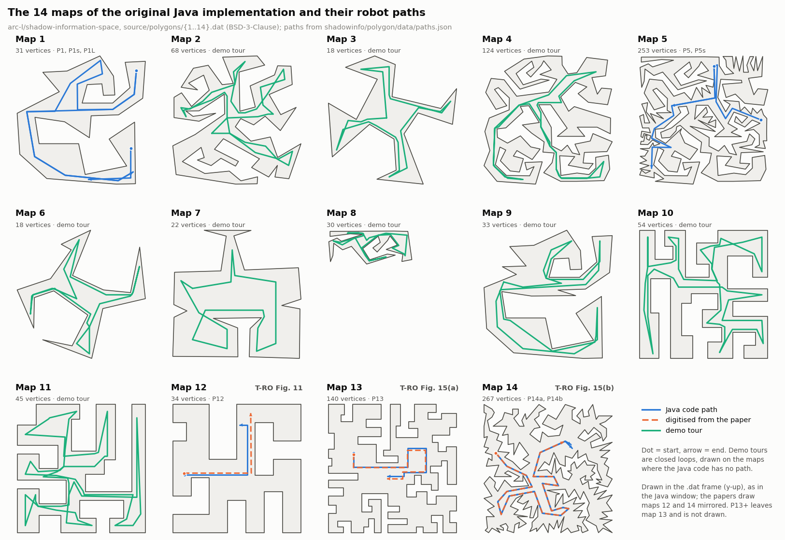

# Shadow Information Spaces

Track how many hidden targets could be in each part of an environment that a
robot cannot currently see, using only the order of a few combinatorial events.

[](https://ru-arcl.github.io/shadow-information-spaces/)

**Demo:** open `docs/index.html` in a browser (no build step, no network), or
serve it with `python -m http.server -d docs`. When GitHub Pages is enabled it is
at <https://ru-arcl.github.io/shadow-information-spaces/>.

## The idea

A robot moving through an environment sees only part of it at any time. The
rest, the *shadow region*, falls into connected pieces called *shadows*. As the
robot moves, shadows **appear, disappear, split and merge** (component events),
and unpredictably moving targets **enter or exit** shadows across the edge of the
field of view (FOV events). We showed that for tracking hidden targets this ordered
stream of critical events is all that matters; the compressed record is a *shadow
information space*, and filters over it are *combinatorial filters*.

If targets move **nondeterministically**, the possible counts per shadow form an
integer program with a totally unimodular constraint matrix. The filter keeps a
small **bipartite I-state** (where targets could have come from → where they could
be now), and **maximum flow** on it gives tight lower and upper bounds for any set
of shadows. If motion and observations are **probabilistic**, a **Bayesian filter**
propagates the exact joint distribution of counts, with truncation heuristics
(TR, RT, RT-LA) for large instances.

## What's here

- **Filters** (`shadowinfo`): event model and incremental bipartite I-state; exact
  bounds by max-flow with lower bounds, our Eq. (7)/(8) recipe and an LP cross-check;
  FOV-event batching; counting, pursuit–evasion and multi-team (partially
  distinguishable) variants; the exact probabilistic filter with TR/RT/RT-LA
  truncation and a Monte Carlo baseline.
- **Port of our original Java code** (`shadowinfo.polygon`): the 14 polygonal maps
  and robot paths of [arc-l/shadow-information-space](https://github.com/arc-l/shadow-information-space);
  critical lines (inflections, bitangents), visibility polygons, gap tracking along a
  path into component events, never-see-evader status, the target oracle, equations,
  bipartite graph and bounds. A command line reproduces what the original program
  printed, and a **live viewer** shows the visibility region following the mouse.
- **Simulators** that turn robot motion into events with ground truth: on the polygon
  maps (random-walk targets, FOV events) and on a grid office map (`shadowinfo.grid`).
- **Browser demo** (`docs/`): the office map and the 14 original maps, with the
  original paths, paths digitised from our papers' figures, or a path you draw;
  live bounds vs. true counts, expected counts, event log and bipartite I-state;
  exact / unknown / single-evader initial knowledge. The JS engine reproduces the
  Python output (events, bounds and simulations exactly; probabilities to 1e-9).
- **Paper reproductions** (`examples/`): T-RO Fig. 11 (s19 bounded to [10, 24]) from
  both the published event sequence and the map-12 geometry; Fig. 15(a)/(b)
  (85 and 385 component events); Table III (1/13, 2/13, 10/13); a Table IV-style
  truncation comparison; office-map counting and pursuit runs.



## Quick start

```bash
pip install -e '.[dev]'     # numpy, scipy (+ matplotlib, networkx, pytest)
```

Bounds from an event stream:

```python
from shadowinfo import CombinatorialFilter, Split, Merge, Enter, Exit, Disappear

events = [Split(1, 3, 4),      # shadow s1 splits into s3 and s4
          Exit(2),             # one target leaves s2 into the field of view
          Merge(4, 2, 5),      # s4 and s2 merge into s5
          Disappear(3, 1, 1),  # s3 is swept clear: it held exactly 1 target
          Enter(5)]            # a visible target walks into s5
for total in (None, (6, 6)):   # optionally: 6 targets were hidden at t0
    f = CombinatorialFilter({1: (2, 4), 2: (3, 3)}, total=total)
    f.extend(events)
    print(total, f.all_bounds(), f.refine_initial_bounds())
```

```text
None {5: (4, 6)} {1: (2, 4), 2: (3, 3)}
(6, 6) {5: (5, 5)} {1: (3, 3), 2: (3, 3)}
```

The same from robot motion on an original map (T-RO Fig. 15(b)):

```python
from shadowinfo.polygon import load_path, get_gaps, SingleTypeAgentOracle, exact_bounds

poly, path = load_path("P14b")            # map 14 with the ProjectPanel5 path
history = get_gaps(poly, path)            # 386 gap sets, 385 component events, 491 shadow labels
oracle = SingleTypeAgentOracle(1_000_000, rng=1).initialize(history)
print(exact_bounds(oracle))               # exact bounds on the 14 shadows alive at the end
```

Command line and viewer:

```bash
python -m shadowinfo.polygon show 14                                  # live viewer: move the mouse
python -m shadowinfo.polygon list                                     # maps and paths
python -m shadowinfo.polygon run ProjectPanel --compat java --seed 1  # what the original printed
python -m shadowinfo.polygon run P13 --seed 3                         # Fig. 15(a) path, bugs fixed
python -m shadowinfo.polygon cuts 12 --summary
python -m shadowinfo.polygon vis 12 300 100
```

In the viewer, click to pin or unpin the robot and use ←/→ to change maps.

Tests and examples:

```bash
pytest -q                                   # Python tests (about 2 minutes)
npm test                                    # JS tests (Node >= 18)
python examples/paper_fig15.py
python examples/office_grid.py --radius 12 --plot   # figures go to ./figures/
```

## Differences from the original Java

`compat="java"` reproduces the original bit for bit, bugs and crashes included; this
is checked against golden outputs recorded from the real Java classes
(`tools/java_reference/`). The default, `compat="fixed"`, corrects them:

- gap tracking never crashes (the original throws on four of the 18 stored paths);
  wherever it does not crash, the gap history is the original's (checked against the
  recorded golden runs and, in a one-off differential test, about 1260 random paths
  run through the live Java). `get_gaps(..., java_matching=False)` also keeps
  each label on its physical shadow where the original's gap matching is ambiguous;
  the simulator uses it;
- the oracle conserves targets (the original double-counts merges, which makes the
  observations inconsistent, e.g. all five recorded Fig. 15(b) runs are infeasible),
  and its random numbers are a seedable clone of `java.util.Random`;
- bounds are exact and cover every final shadow; the original's max-flow bounds depend
  on JVM hash order and can be wrong (kept as `java_bounds` for comparison);
- smaller fixes: degenerate visibility scans, 45° path segments, blank lines in map
  files, input validation.

`docs/notes/original_java.md` lists every original function with its counterpart and
every quirk; `docs/notes/original_maps.md` says which map and path produced which
figure; `docs/DESIGN.md` describes the design.

## References

This repository re-implements our work in Python and JavaScript. Our original Java
implementation is at
[arc-l/shadow-information-space](https://github.com/arc-l/shadow-information-space).

```bibtex
@article{YuLav12TRO,
  author  = {Yu, Jingjin and LaValle, Steven M.},
  title   = {Shadow Information Spaces: Combinatorial Filters for Tracking Targets},
  journal = {IEEE Transactions on Robotics},
  volume  = {28}, number = {2}, pages = {440--456}, year = {2012},
  doi     = {10.1109/TRO.2011.2174494}
}
@inproceedings{YuLav10ICRA,
  author    = {Yu, Jingjin and LaValle, Steven M.},
  title     = {Probabilistic Shadow Information Spaces},
  booktitle = {Proc. IEEE International Conference on Robotics and Automation (ICRA)},
  pages     = {3543--3549}, year = {2010},
  doi       = {10.1109/ROBOT.2010.5509588}
}
@inproceedings{YuLav08ICRA,
  author    = {Yu, Jingjin and LaValle, Steven M.},
  title     = {Tracking Hidden Agents Through Shadow Information Spaces},
  booktitle = {Proc. IEEE International Conference on Robotics and Automation (ICRA)},
  pages     = {2331--2338}, year = {2008},
  doi       = {10.1109/ROBOT.2008.4543562}
}
```

## License

BSD 3-Clause; see [LICENSE](LICENSE).
